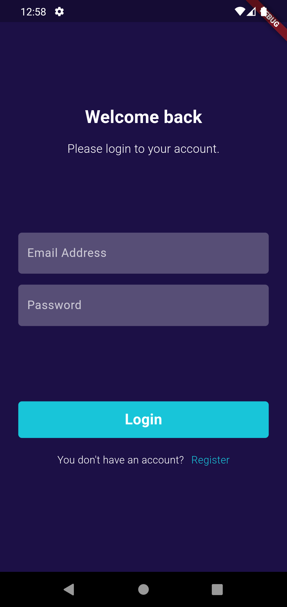
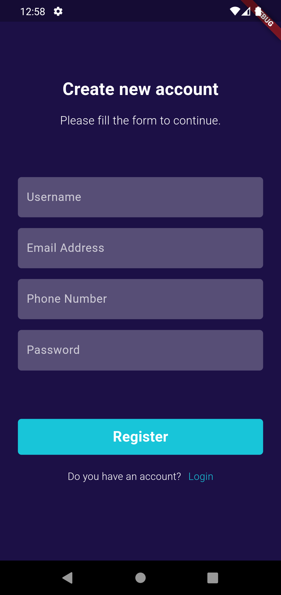
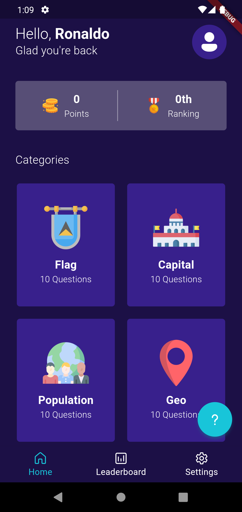
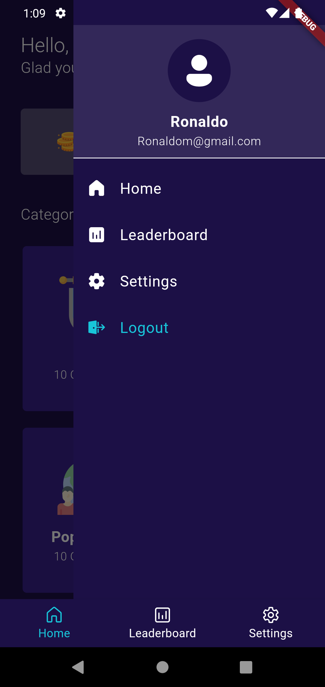
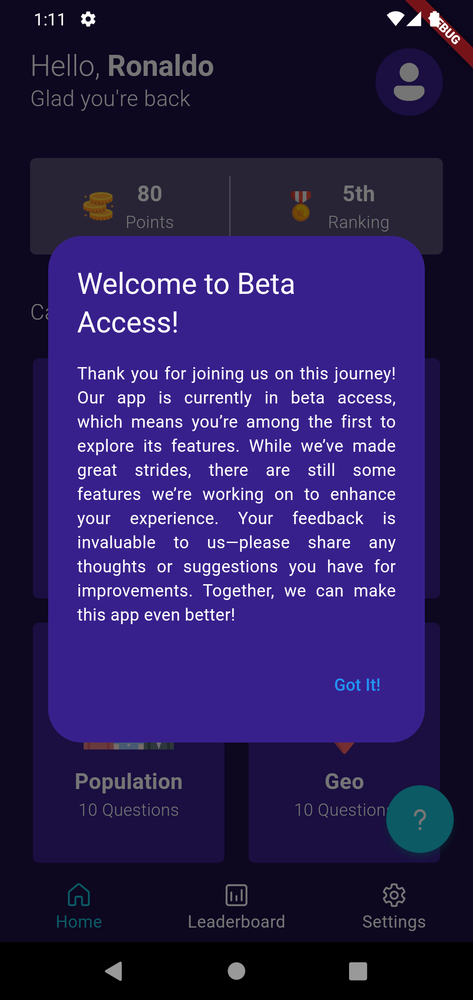
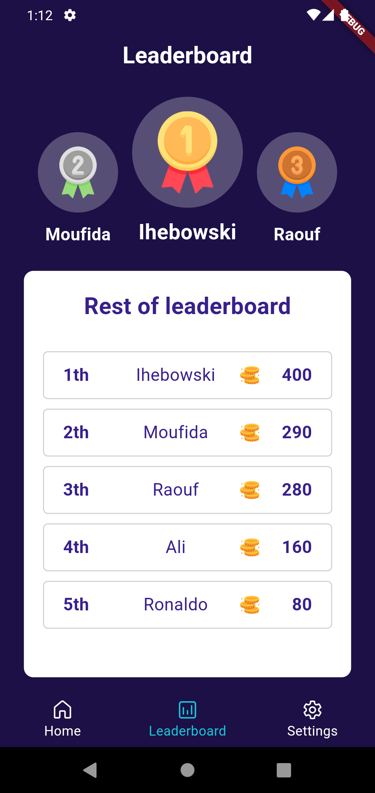
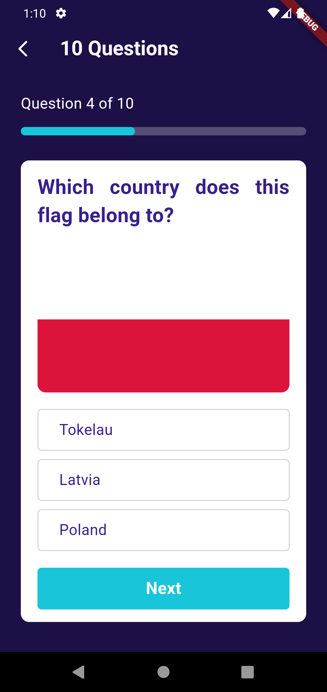

# GeoQuest

GeoQuest is a fun and interactive geography quiz game that tests your knowledge of countries, flags,
capitals, and more! With multiple game modes, real-time multiplayer challenges, and progressive
difficulty, you’ll explore the world while improving your geography skills.

## Features

- **Flag Guessing**: Guess the country based on its flag.
- **Capital Challenge**: Test your knowledge of country capitals.
- **Country Outline Quiz**: Identify countries by their outline.
- **Population Comparison**: Pick the country with the larger population.
- **Leaderboard**: Track your global ranking and see how you compare.
- **Achievements & Rewards**: Unlock achievements and earn rewards as you play.

## Screenshots

Here are some screenshots of the GeoQuest app in action:

### Login Page

<div style="display: flex; justify-content: space-around;">
    
</div>
*Login Page for user authentication.*

### Signup Page

<div style="display: flex; justify-content: space-around;">
    
</div>
*Signup Page for new user registration.*

### Home Page

<div style="display: flex; justify-content: space-around;">
    
    
    
</div>
*Home Page showing featured Quiz challenges.*

### Leaderboard Page

<div style="display: flex; justify-content: space-around;">
    
</div>
*Leaderboard Page for displaying players in ranks.*

### Quiz Page

<div style="display: flex; justify-content: space-around;">
    
    
</div>
*Quiz Page for passing the quiz question.*

### Result Page

<div style="display: flex; justify-content: space-around;">
    
</div>
*Result Page for displaying the result points.*

## Tech Stack

- **Frontend Framework**: Flutter
- **State Management**: GetX (or any state management tool used)
- **Database Platform**: Firebase
- **REST Countries API**: REST Countries API

## Installation

### Prerequisites

- Flutter installed on your machine. Follow
  the [Flutter installation guide](https://flutter.dev/docs/get-started/install) if not already
  installed.

### Steps

1. Clone the repository:

   ```bash
   git clone https://github.com/Ihebowski/GeoQuest.git
   ```

2. Navigate to the directory:

   ```bash
   cd GeoQuest
   ```

3. Install the dependencies:

   ```bash
   flutter pub get
   ```

4. Run the app:

   ```bash
   flutter run
   ```

   Ensure that you have a device or emulator running.

## Project Structure

```
lib/src/
 ├── models/         # Contains data models representing the application's data structure
 ├── views/          # UI screens for the app's interface, including layouts and widgets
 ├── repositories/   # Manages server connections and data retrieval for the app
 ├── services/       # Handles API calls and business logic for data management
 ├── controllers/    # GetX controllers managing state and application logic
 ├── styles/         # Defines the styling and theming for the app's UI
 └── main.dart       # Main entry point of the app
```

## Contributions

Feel free to fork the repository, open an issue, or submit a pull request for any improvements or
bug fixes.

## License

This project is licensed under the MIT License. See the [LICENSE](LICENSE) file for more
information.
